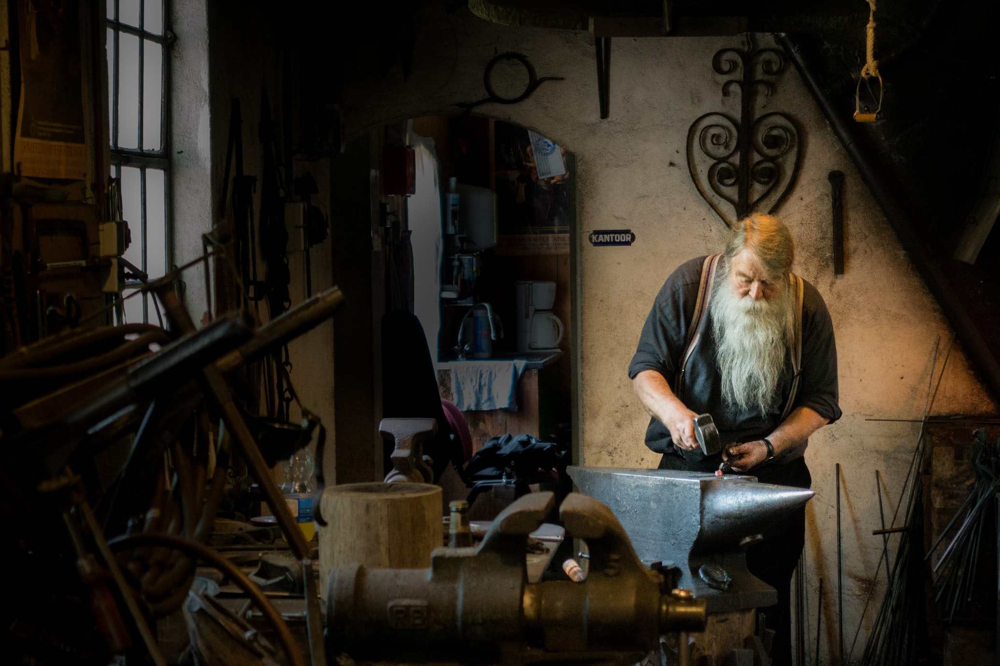

Computer Science Excursions
======

Software engineering is a craft and as such requires continuous hands-on practice, one needs to have skin in the game.
CSE is my attempt at forging a path to true craftsmanship.

> Computer science education cannot make anybody an expert programmer any more than studying brushes and pigment can make somebody an expert painter.
>
> -- Eric S. Raymond

The most efficient way is by building full-scale software as it's the direct application of craft, though this has two
significant limitations: it's very effort-heavy and *usually* limited to a single domain. Another approach is by doing a
limited-scale excursions into specific topics of interest, something akin to code kata.

While the former is absolutely necessary and fundamental, the latter is great when treated as a supplementary
measure. **Computer Science Excursions** is a sample of such approach - these will be usually short, very targeted
exercises spanning a very broad range of topics within software engineering and general science.

Idea was initially inspired by [Peter Norvig's Teach Yourself Programming in Ten Years](https://norvig.com/21-days.html)
and his [pytudes](https://github.com/norvig/pytudes) project. I'm not sure 10 years is enough, the journey itself is the
goal. Never stop learning.

### Table of contents

| Year  | Description                                                                               | Extras                                                                    |
|-------|:------------------------------------------------------------------------------------------|---------------------------------------------------------------------------| 
| 2022  | [CodinGame: Spring Challenge](generic/python/codingame/spring_challenge.py)               | [Post](https://www.laeith.com/posts/2022-04-22-codingame-springchallenge) |
| 2021  | [Advent of Code 2021](aoc/adventofcode2021)                                               |                                                                           |
| 2021  | [Wire protocol benchmarks](generic/java/src/main/java/com/laeith/com/sci/excursions/wire) | [Post](https://www.laeith.com/posts/2021-04-04-wire-formats/)             |
| Cont. | [Math/programming problems](generic/python/problems)                                      |                                                                           |

---

